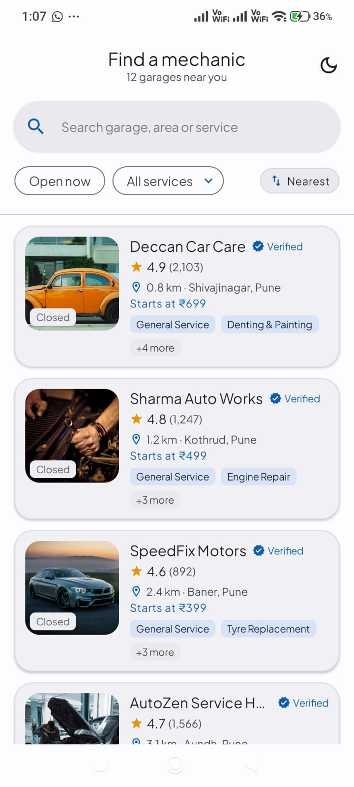
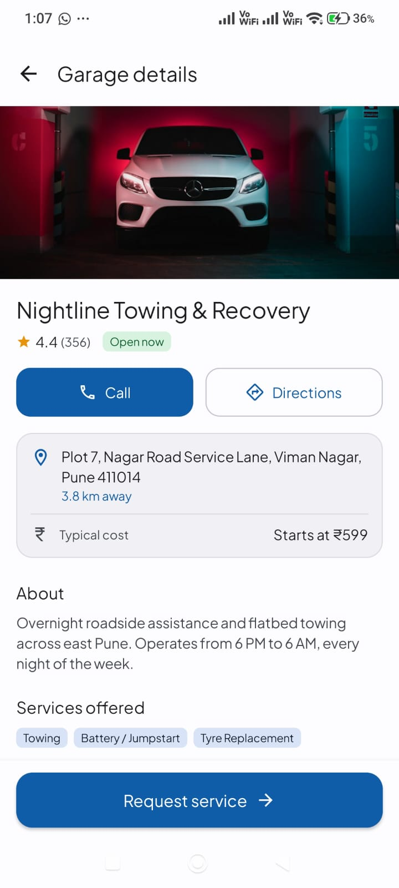
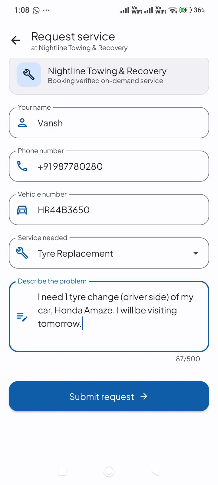
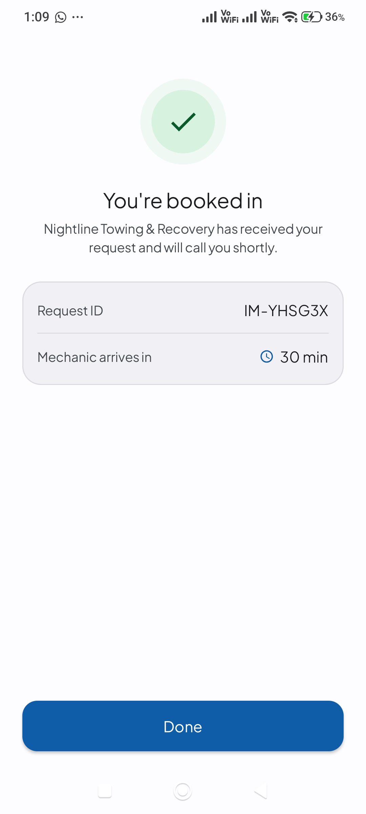
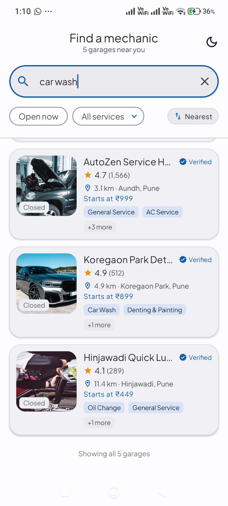
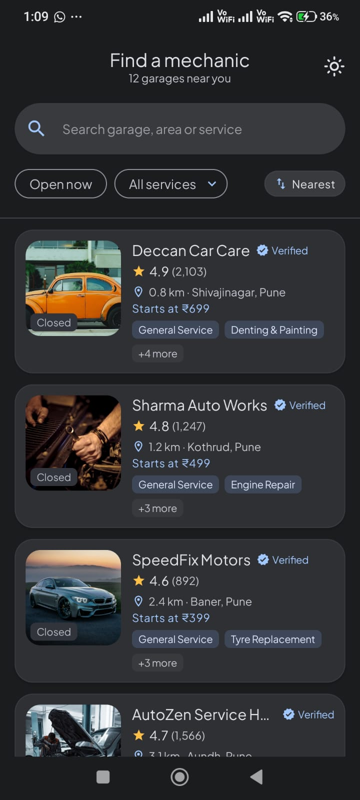

# Instant Mechanic 🚗🔧

[](https://developer.android.com)
[](https://kotlinlang.org)
[](https://developer.android.com/jetpack/compose)
[](https://dagger.dev/hilt/)
[]()
[]()
[]()

**Instant Mechanic** is a modern Android application built with **Jetpack Compose**, **Clean Architecture**, and **Material 3** that lets users discover nearby automotive repair garages, browse services and operating hours, call garages directly, and request vehicle repair services with real-time input validation and receipt generation.

---

## 🎥 App Demo Video

<div align="center">
  <video src="docs/video/demo_video.mp4" controls="controls" width="360" style="max-height: 720px; border-radius: 16px;">
    Your browser does not support the video tag.
  </video>
  <p>📹 <em>Direct Video Link:</em> <a href="docs/video/demo_video.mp4"><strong>Watch demo_video.mp4</strong></a></p>
</div>

---

## 📸 Screen Gallery

| 1. Home Screen | 2. Garage Details | 3. Request Service Form |
|:---:|:---:|:---:|
|  |  |  |

| 4. Booking Confirmed | 5. Search & Filters | 6. Dark Mode Preview |
|:---:|:---:|:---:|
|  |  |  |

---

## ✨ Core Features

### 🔍 1. Discovery, Search, Filtering & Sorting
- **Real-Time Debounced Search**: 350 ms debounce ensures optimal typing performance without spamming requests.
- **Service Type Filters**: Instant single-select chips (e.g. *General Service, Oil Change, Brake Repair, AC Service, Towing*).
- **"Open Now" Toggle**: Dynamically checks whether a garage is currently open based on real-time clock evaluation.
- **Infinite Scroll & Pagination**: Paginated fetching (page size = 4) with seamless infinite scrolling as the user reaches the bottom, along with visible page counters and completion indicators.
- **Server-Side Sorting**: Sort garages by **Highest Rating** or **Nearest Distance**.
- **Offline & Cache Resilience**: Bundled mock dataset, 10 MiB OkHttp disk cache, in-memory repository cache, and deterministic offline gradient image fallbacks ensuring full offline functionality.
- **Responsive Feedback**: Shows initial full-page loading spinner on cold boot, and a slim non-blocking indicator during re-querying.

### 🏢 2. Detailed Garage Profile
- **Hero Image & Overview**: High-resolution curated automotive photography tailored specifically to the garage's name and service capability, with smooth Coil crossfade transitions and gradient fallback.
- **One-Tap Dialing**: Phone row integrated with Android `ACTION_DIAL` intent to call the garage immediately.
- **Services Offerings**: Structured grid displaying all services performed with dedicated badges.
- **Weekly Schedule**: 7-day operating hours table with **today's row automatically highlighted**.
- **Pinned Action Bar**: Persistent CTA to initiate service booking, with full edge-to-edge system navigation bar safe area insets.

### 📝 3. Service Booking & Validation
- **Smart Prefilling**: Automatically links the selected garage and pre-selects service options if single-service.
- **Strict Input Validation** (`ServiceRequestValidator`):
  - **Name**: Minimum 2 characters.
  - **Phone**: Valid Indian phone format (10 digits, optional `+91` prefix, auto-stripping non-numeric noise).
  - **Vehicle Registration Number**: Validated against Indian vehicle plate formats (e.g., `MH12AB1234`).
  - **Service Selection**: Mandatory service selection from available garage capabilities.
  - **Problem Description**: Minimum 10 characters, maximum 500 characters with live character counter.
- **Interactive Validation State**: Errors are kept discreet until the user first clicks submit, after which fields dynamically clear errors as the user corrects them.
- **Keyboard & Navigation Insets**: Wrapped in `.imePadding()` and `.navigationBarsPadding()` so the form and submit button are never covered by the on-screen keyboard or navigation bar.

### 🧾 4. Confirmation Receipt
- Displays generated **Request ID**, selected service name, garage name, and estimated arrival/service **ETA in minutes**.
- Full system bar insets preventing overlap with status bar or navigation buttons.
- "Done" button returns user cleanly to the home screen.

### 🌓 5. Dynamic Theme & Modern UX
- **Plus Jakarta Sans Typography**: Bundled modern geometric typeface across all display, title, body, and label styles for crisp, premium mobile readability.
- **One-Tap Light / Dark Mode**: Dedicated top app bar action toggles between light and dark themes across the whole app, with persistent state management in `MainActivity`.
- **Edge-to-Edge System Bar Handling**: Proper WindowInsets padding applied across all screens to ensure 3-button navigation bars and gesture handles never collide with buttons or text.

---

## 🏛️ Architecture & Clean Design

The project strictly follows **Clean Architecture** and **MVVM** with unidirectional data flow (UDF). Every architectural layer is modular, independent, and explainable in a technical interview:

```
app/src/main/java/com/instantmechanic/
├── MechanicApp.kt                        # Application class with @HiltAndroidApp
├── MainActivity.kt                       # Single activity host with @AndroidEntryPoint
│
├── core/
│   ├── result/AppResult.kt               # Sealed interface: AppResult.Success | AppResult.Failure
│   └── ui/                               # Design system atoms: StateViews, Badges, MechanicImage
│
├── domain/                               # Pure Kotlin domain layer (zero Android dependencies)
│   ├── model/                            # Mechanic, MechanicDetail, DayHours, OpeningHours, ServiceRequest
│   ├── repository/MechanicRepository.kt  # Clean repository interface
│   └── validation/                       # ServiceRequestValidator (heavily unit-tested)
│
├── data/                                 # Data & Network layer
│   ├── remote/MechanicApiService.kt      # Real Retrofit service interface
│   ├── remote/dto/                       # Kotlinx-serializable DTOs
│   ├── remote/mock/MockApiInterceptor.kt # Asset-backed OkHttp interceptor with latency & query engine
│   ├── mapper/                           # DTO <-> Domain mappers & OpeningHours dynamic clock parser
│   └── repository/MechanicRepositoryImpl.kt # Implements domain repository, maps exceptions to AppResult
│
├── di/                                   # Dagger Hilt dependency injection
│   ├── NetworkModule.kt                  # Provides OkHttpClient, Retrofit, MechanicApiService
│   ├── RepositoryModule.kt               # Binds MechanicRepository -> MechanicRepositoryImpl
│   └── AppModule.kt                      # Provides java.time.Clock and CoroutineDispatchers
│
└── ui/                                   # Jetpack Compose UI layer
    ├── home/                             # HomeScreen, HomeViewModel, MechanicCard, HomeUiState
    ├── detail/                           # DetailScreen, DetailViewModel, DetailUiState
    ├── request/                          # RequestServiceScreen, RequestServiceViewModel, ConfirmationScreen
    ├── navigation/                       # AppNavHost, Routes (type-safe navigation)
    └── theme/                            # Material 3 Color palette, Typography, Theme
```

### Why the Mock API Interceptor Pattern?
1. **Zero-Setup Clone & Run**: A technical interviewer can clone the repo and hit `Run` immediately. No external API keys to generate, no expired mock servers, and no broken staging backends.
2. **Real Network Semantics**: The app uses a real Retrofit interface, real HTTP response codes (`200 OK`, `400 Bad Request`, `404 Not Found`, `503 Service Unavailable`), real latency delays (500–1100ms), and genuine `kotlinx.serialization` parsing.
3. **Seamless Backend Swap**: Swapping to a production live server requires changing only one `BuildConfig` flag (`USE_MOCK_API = false`) with zero changes to ViewModels, Repositories, or UI code.

### Dynamic Open / Closed Computation
Rather than trusting a static server boolean, the app parses the weekly hours JSON table and compares it against an injected `java.time.Clock`. This allows:
- Deterministic unit testing across timezones, midnight-spanning shifts, and off-days.
- Real-time status that remains accurate even when the app stays open across opening or closing boundaries.

---

## 🧪 Comprehensive Unit Testing

The project includes **135 automated unit tests** covering validation rules, query parameter filtering, sorting, state transitions, and error recovery:

| Test Suite | Test Count | Scope |
|---|:---:|---|
| [`ServiceRequestValidatorTest`](app/src/test/java/com/instantmechanic/domain/validation/ServiceRequestValidatorTest.kt) | **30** | Name, phone (+91 variations), vehicle plate regex, character counters |
| [`MockApiInterceptorTest`](app/src/test/java/com/instantmechanic/data/remote/mock/MockApiInterceptorTest.kt) | **23** | Search queries, service filtering, openNow filter, sorting, 404 & 503 handling |
| [`HomeViewModelTest`](app/src/test/java/com/instantmechanic/ui/home/HomeViewModelTest.kt) | **22** | Loading state, debounced search, filter mutations, error & retry flows |
| [`RequestServiceViewModelTest`](app/src/test/java/com/instantmechanic/ui/request/RequestServiceViewModelTest.kt) | **22** | Preselection, inline validation triggers, submit loading, error handling |
| [`OpeningHoursTest`](app/src/test/java/com/instantmechanic/domain/model/OpeningHoursTest.kt) | **14** | Clock boundaries, weekend schedules, overnight hours |
| [`MechanicMapperTest`](app/src/test/java/com/instantmechanic/data/mapper/MechanicMapperTest.kt) | **13** | DTO to Domain transformation, price tiers, photo parsing |
| [`MockDataFixtureTest`](app/src/test/java/com/instantmechanic/data/remote/mock/MockDataFixtureTest.kt) | **11** | Integrity of bundled `mechanics.json` asset fixture |
| **Total** | **135** | **100% Green (0 failures, 0 skipped)** |

### Run Tests via Terminal
```bash
# Run all unit tests
./gradlew testDebugUnitTest

# Run code linter
./gradlew lintDebug

# Build debug APK
./gradlew assembleDebug
```

---

## 🚀 Getting Started

### Prerequisites
- **Android Studio** Hedgehog (2023.1.1) or newer / Ladybug
- **JDK 17** (configured as Gradle JDK)
- **Android SDK** API 35 installed
- **Android Device / Emulator** running Android 7.0+ (API 24+)

### Clone and Run
```bash
# 1. Clone the repository
git clone https://github.com/vansh-121/InstantMechanic.git
cd InstantMechanic

# 2. Build and run unit tests
./gradlew testDebugUnitTest

# 3. Install on connected device or emulator
./gradlew installDebug
```

---

## 📐 Assumptions & Design Trade-offs

1. **In-Memory Mock Backend**:
   - Because no public backend API was specified, mock JSON is bundled in assets and queried via an OkHttp interceptor simulating server-side latency. Set `USE_MOCK_API = false` in `app/build.gradle.kts` to connect to a live backend.
2. **Indian Locale Context**:
   - Phone numbers validate against 10-digit Indian formats with optional `+91` prefix.
   - Vehicle registration numbers match standard Indian formats (e.g. `MH12AB1234` or `DL01A1234`).
   - Currency display is formatted in Indian Rupees (₹).
3. **Static Distance Metric**:
   - Garage distances are provided in the dataset rather than requesting runtime GPS permissions, ensuring first-run evaluation has zero permission blockers.
4. **Authentication**:
   - Authentication (e.g. Firebase Auth) was omitted intentionally to prevent missing `google-services.json` build failures for reviewers.

---

## 👨‍💻 Git Workflow & Push Instructions

```bash
# Check remote status
git remote -v

# Push to your GitHub repository
git push origin main
```
